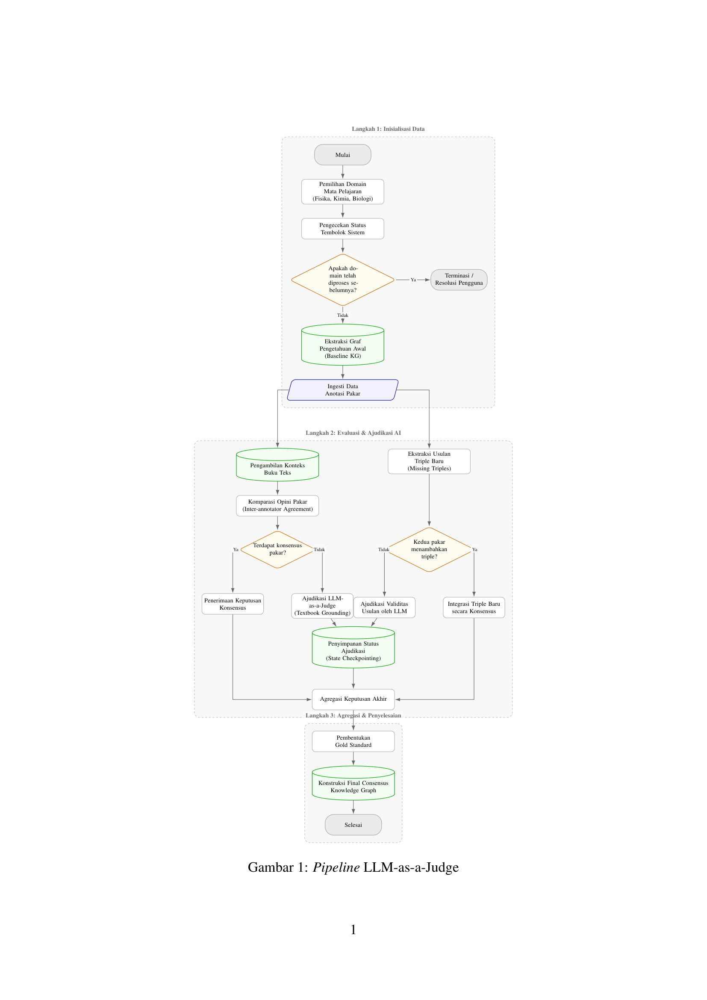

# Final Consensus Code

This folder contains the notebooks and data used to consolidate expert
validation into final gold standards, compute validation metrics, and ingest the
consensus knowledge graphs into Neo4j.

## Directory Map

```text
KG_CONSENSUS.ipynb              # builds one subject's final consensus outputs
KG_CONSENSUS_METRICS.ipynb      # computes AC1, precision, recall, and F1
KG_CONSENSUS_NEO4J_INGEST.ipynb # ingests consensus KG JSON files into Neo4j
.env.example                    # environment variable template

validations/                    # expert review JSON inputs
pdf-extracted/                  # extracted textbook context for LLM judging
kg/                             # original KG JSONs and consensus KG exports
checkpoints/                    # cached LLM judge calls for disagreements

*_gold_standard.json            # final per-subject gold standard exports
```

## Setup

Run notebooks from this folder:

```bash
cd assets/codes/final-consensus
```

Create and fill a local `.env` file:

```bash
cp .env.example .env
```

Required for `KG_CONSENSUS.ipynb` when unresolved disagreements need LLM
judging:

```text
GEMINI_API_KEY=
SUBJECT=Kimia
SUBJECT_SLUG=kimia
GRADE=XII
JUDGE_MAX_CHUNKS=10
```

Required only for `KG_CONSENSUS_NEO4J_INGEST.ipynb`:

```text
NEO4J_URI=
NEO4J_USER=
NEO4J_PASS=
NEO4J_DB=
NEO4J_CLEAR_CONSENSUS=1
```

Install notebook dependencies if they are not already available:

```bash
pip install pandas google-genai python-dotenv neo4j jupyter
```

## Pipeline Overview



## Run Order

1. Open `KG_CONSENSUS.ipynb`.
2. Set `SUBJECT` and `SUBJECT_SLUG` in `.env`.
3. Run the notebook once per subject:

```text
SUBJECT=Biologi  SUBJECT_SLUG=biologi
SUBJECT=Fisika   SUBJECT_SLUG=fisika
SUBJECT=Kimia    SUBJECT_SLUG=kimia
```

This notebook reads:

```text
kg/<Subject> Kelas XII.json
validations/expert-<subject>-4.json
validations/expert-<subject>-6.json
pdf-extracted/<Subject> Kelas XII_ebook_context_*.json
```

It writes:

```text
<subject>_gold_standard.json
kg/<Subject> Kelas XII.consensus.json
checkpoints/<subject>_*.jsonl
```

Then run:

1. `KG_CONSENSUS_METRICS.ipynb` to compute validation metrics from all
   `*_gold_standard.json` files.
2. `KG_CONSENSUS_NEO4J_INGEST.ipynb` to ingest
   `kg/*.consensus.json` into Neo4j.

## Inputs

- `kg/*.json`: source KG exports before final consensus fields are embedded.
- `validations/expert-*-4.json` and `validations/expert-*-6.json`: two expert
  review files per subject.
- `validations/expert-phase-2.json`: phase 2 cross-book validation data.
- `pdf-extracted/*.json`: textbook context snippets used by the LLM judge.
- `checkpoints/*.jsonl`: cached LLM judge results; keep these to avoid repeated
  API calls when rerunning consensus.

## Outputs

- `biologi_gold_standard.json`
- `fisika_gold_standard.json`
- `kimia_gold_standard.json`
- `kg/Biologi Kelas XII.consensus.json`
- `kg/Fisika Kelas XII.consensus.json`
- `kg/Kimia Kelas XII.consensus.json`

The gold standard files are the flat validation outputs used by
`KG_CONSENSUS_METRICS.ipynb`. The `*.consensus.json` files are KG exports with
final consensus labels and review metadata embedded into their relation nodes.

## Neo4j Notes

`KG_CONSENSUS_NEO4J_INGEST.ipynb` creates uniqueness constraints, optionally
clears existing consensus nodes for the ingested grades, and writes Grade,
Chapter, Subtopic, Concept, ConceptTarget, structural edges, and semantic
consensus relations.

Set `NEO4J_CLEAR_CONSENSUS=0` to merge/update without clearing existing
consensus data. Set it to `1` when rebuilding the consensus graph from scratch.

For graph analytics, use semantic `Concept -> Concept` relationships rather
than structural Grade/Chapter/Subtopic edges, because structural edges can
distort community and modularity metrics.

## Typical Navigation

- Start with `validations/` to inspect expert raw ratings.
- Use `KG_CONSENSUS.ipynb` to resolve disagreements and produce gold standards.
- Use `*_gold_standard.json` to inspect final labels.
- Use `KG_CONSENSUS_METRICS.ipynb` to reproduce table-level metrics.
- Use `kg/*.consensus.json` or `KG_CONSENSUS_NEO4J_INGEST.ipynb` to inspect the
  final graph artifact.
